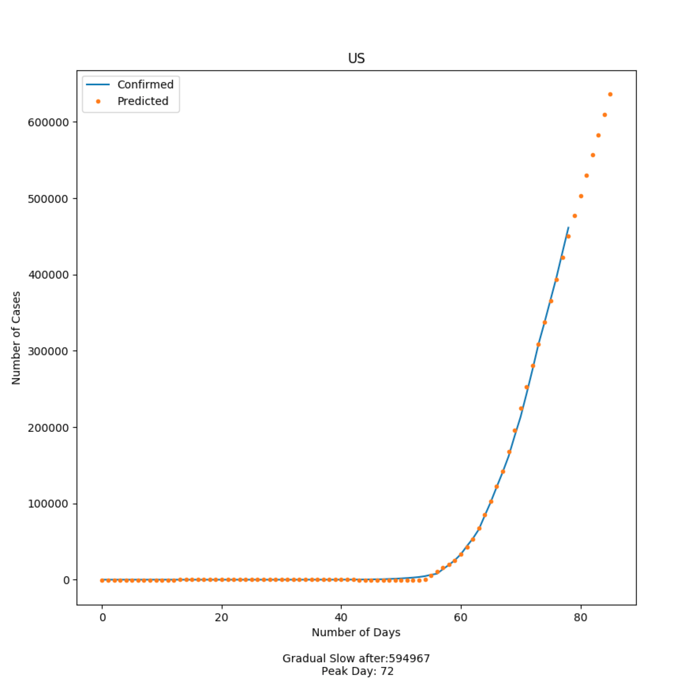

# Coronavirus-Analysis

Let's visualize how the cases around the world have increased. We can see that China seems to have flattened the curved, Italy had hit its peak 
but US still has more day before peaking. 

I created this visualization with the help of Plotly in Python.
To run the visualization: python Visualization.py

# Data Analysis in Progress

 
###USA
* This is based on data until April 10, 2020.
* We can see the gradual decrease in exponential rise around day 72 as predicted based on the current data.
* US should peak when it will have around 600,000 cases as seen by this model. 
* In this model, I am using Multi-layer Perceptron regressor to predict the data. The peak day and numbers is found by fitting the log curve.

# Credits

The visualization pulls data on COVID-19 provided by Johns Hopkins CSSE. Huge thanks to them for making it public. 
Data from here: https://github.com/CSSEGISandData/COVID-19 & https://github.com/datasets/covid-19
